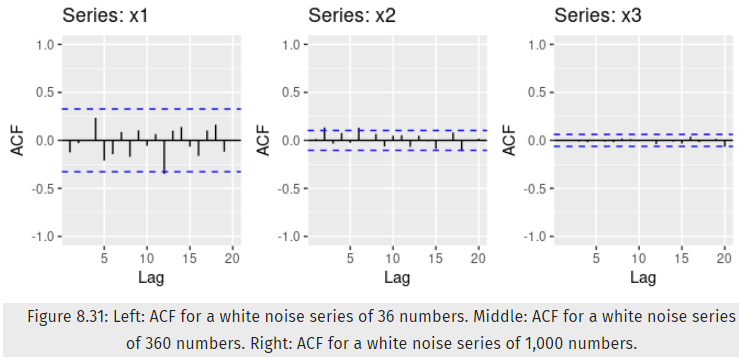

```{r global-options, include=FALSE}
knitr::opts_chunk$set(echo=TRUE, warning=FALSE,
                      message=FALSE,
                      collapse = FALSE,
                      comment = "#>" )
```


# Week 3: ARIMA Models [13-Jun 19-Jun]
 
<br>


## Chapter 8 ARIMA Models (Forecasting: Principle and Practice HA)

### Exercise 8.11.1 (aka 8.1)

Figure 8.31 shows the ACFs for 36 random numbers, 360 random numbers and 1,000 random numbers.

#### 8.11.1.a 

Explain the differences among these figures. Do they all indicate that the data are white noise?




<!--  -->

<br>

#### 8.11.1.b

Why are the critical values at different distances from the mean of zero? Why are the autocorrelations different in each figure when they each refer to white noise?

<br>


### Exercise 8.11.2 (aka 8.2)

A classic example of a non-stationary series is the daily closing IBM stock price series (data set ibmclose). Use R to plot the daily closing prices for IBM stock and the ACF and PACF. Explain how each plot shows that the series is non-stationary and should be differenced.

<br>


### Exercise 8.11.6 (aka 8.6)

Use R to simulate and plot some data from simple ARIMA models.

### Exercise 8.11.6.a

Use the following R code to generate data from an AR(1) model with  
$\phi_1 = 0.6$ and $\sigma^2 = 1$. The process starts with $y_1 = 0$. 

```{r}
y <- ts(numeric(100))
e <- rnorm(100)
for(i in 2:100)
  y[i] <- 0.6*y[i-1] + e[i]
```


<br>


### Exercise 8.11.6.b

Produce a time plot for the series. How does the plot change as you change $\phi = 1$?  

<br>


### Exercise 8.11.6.c

Write your own code to generate data from an MA(1) model with $\theta_1 = 0.6$ and $\sigma^2 = 1$.


<br>


### Exercise 8.11.6.d

Produce a time plot for the series. How does the plot change as you change $\theta_1$?

<br>


### Exercise 8.11.6.e

Generate data from an ARMA(1,1) model with $\phi_1 = 0.6$, $\theta_1 = 0.6$, and $\sigma^2 = 1$


<br>


### Exercise 8.11.6.f

Generate data from an AR(2) model with $\phi_1 = 0.8$, $\phi_2 = 0.3$, and $\sigma^2 = 1$.  (Note that these parameters will give a non-stationary series.)

<br>


### Exercise 8.11.6.g

Graph the latter two series and compare them.

<br>


### Exercise 8.11.8 (aka 8.8)

Consider austa, the total international visitors to Australia (in millions) for the period 1980-2015.

```{r}
library(fpp2)
library(forecast)
data(austa)
```


#### Exercise 8.11.8.a

Use auto.arima() to find an appropriate ARIMA model. What model was selected. Check that the residuals look like white noise. Plot forecasts for the next 10 periods.

* The $auto.arima()$ function selected the **ARIMA(0,1,1) with drift** model.

* The residuals from the selected model look like white noise because appear to be normal and not obviously significant.

* The forecasts plot for the next 10 periods shows a steady upwards positive trend.

<br>

```{r}
# Fit best ARIMA model to the austa time series
auto_arima_austa <-forecast::auto.arima(austa)

# Show the results summary of the fitted model 
summary(auto_arima_austa)
```


```{r}
# Check that residuals from the time series model look like white noise
# and produce a time plot of the residuals
checkresiduals(auto_arima_austa, plot = TRUE)
```


```{r}
# Forecasts for the next 10 periods
fc_auto_arima_austa <- forecast(auto_arima_austa, h = 10)

# Plot forecasts for the next 10 periods
autoplot(fc_auto_arima_austa) +
  ggtitle("Forecasts for next 10 periods from ARIMA(0,1,1) with Drift") +
  theme_bw() +
  scale_x_continuous(breaks = seq(from = 1980, to = 2030, by = 5)) +
  scale_y_continuous(breaks = seq(from = 0, to = 11, by = 1))
```


<br>


#### Exercise 8.11.8.b

Plot forecasts from an ARIMA(0,1,1) model with no drift and compare these to part a. Remove the MA term and plot again.

* Compared to the forecast plot in part (a), the forecasts plot from an ARIMA(0,1,1) model with no drift, no longer longer shows an upward trend. Instead, it shows a constant flat line at 7.0.

* Compared to the forecast plot in part (a), the forecasts plot from an ARIMA(0,1,0) model with no drift and with the MA term removed, also shows a constant flat line but shifted 0.1735 units below 7.0. Additionally, the confidence intervals (80 and 95) seem to have narrowed slightly.


```{r}
# Fit an ARIMA(0,1,1) model to the austa time series
# by default the include.drift parameter is set to FALSE
arima_011_nd_austa <- forecast::Arima(austa, order = c(0, 1, 1), include.drift = FALSE)

# Forecasts for the next 10 periods
fc_arima_011_nd_austa <- forecast(arima_011_nd_austa, h = 10)

# Plot forecasts for the next 10 periods
autoplot(fc_arima_011_nd_austa) +
  ggtitle("Forecasts for next 10 periods from ARIMA(0,1,1) without Drift") +
  theme_bw() +
  scale_x_continuous(breaks = seq(from = 1980, to = 2030, by = 5)) +
  scale_y_continuous(breaks = seq(from = 0, to = 11, by = 1))
```

```{r}
# Fit an ARIMA(0,1,0) model (MA term removed) to the austa time series
# by default the include.drift parameter is set to FALSE
arima_010_nd_austa <- forecast::Arima(austa, order = c(0, 1, 0), include.drift = FALSE)

# Forecasts for the next 10 periods
fc_arima_010_nd_austa <- forecast(arima_010_nd_austa, h = 10)

# Plot forecasts for the next 10 periods
autoplot(fc_arima_010_nd_austa) +
  ggtitle("Forecasts for next 10 periods from ARIMA(0,1,0) without Drift") +
  theme_bw() +
  scale_x_continuous(breaks = seq(from = 1980, to = 2030, by = 5)) +
  scale_y_continuous(breaks = seq(from = 0, to = 11, by = 1))
```

<br>

#### Exercise 8.11.8.c

Plot forecasts from an ARIMA(2,1,3) model with drift. Remove the constant and see what happens.

When comparing the ARIMA(2,1,3) with drift model vs the same model but with the constant removed, we see that 

* The first forecast plot shows a slowly upward trend (almost concave down shape)
* The second forecast plot shows a faster upward trend (almost linear shape)
* The confidence intervals for the second one are wider.

<br>

```{r}
# Fit an ARIMA(2,1,3) model with drift to the austa time series
arima_213_wd_austa <- forecast::Arima(austa, order = c(2,1,3), include.drift = TRUE)

# Forecasts for the next 10 periods
fc_arima_213_wd_austa <- forecast(arima_213_wd_austa, h = 10)

# Plot forecasts for the next 10 periods
autoplot(fc_arima_213_wd_austa) +
  ggtitle("Forecasts for next 10 periods from ARIMA(2,1,3) with Drift") +
  theme_bw() +
  scale_x_continuous(breaks = seq(from = 1980, to = 2030, by = 5)) +
  scale_y_continuous(breaks = seq(from = 0, to = 11, by = 1))
```


```{r}
# Fit an ARIMA(2,1,0) model (constant removed) with drift to the austa time series
arima_210_wd_austa <- forecast::Arima(austa, order = c(2,1,0), include.drift = TRUE)

# Forecasts for the next 10 periods
fc_arima_210_wd_austa <- forecast(arima_210_wd_austa, h = 10)

# Plot forecasts for the next 10 periods
autoplot(fc_arima_210_wd_austa) +
  ggtitle("Forecasts for next 10 periods from ARIMA(2,1,0) with Drift") +
  theme_bw() +
  scale_x_continuous(breaks = seq(from = 1980, to = 2030, by = 5)) +
  scale_y_continuous(breaks = seq(from = 0, to = 11, by = 1))
```


<br>

#### Exercise 8.11.8.d

Plot forecasts from an ARIMA(0,0,1) model with a constant. Remove the MA term and plot again.

When comparing the forecast plots of ARIMA(0,0,1) model with that of the ARIMA(0,0,0) model, we see that

* The first one shows an immediate trend drop to 5.0 followed by asharp linear downwards trend for the first period, then followed by a flat line trend.

* The second one shows an immediate trend drop to 3.5 followed by a flat line trend.

* The confidence intervals on the second one are wider.

<br>

```{r}
# Fit an ARIMA(0,0,1) model to the austa time series
arima_001_nd_austa <- forecast::Arima(austa, order = c(0,0,1), include.drift = FALSE)

# Forecasts for the next 10 periods
fc_arima_001_nd_austa <- forecast(arima_001_nd_austa, h = 10)

# Plot forecasts for the next 10 periods
autoplot(fc_arima_001_nd_austa) +
  ggtitle("Forecasts for next 10 periods from ARIMA(0,0,1)") +
  theme_bw() +
  scale_x_continuous(breaks = seq(from = 1980, to = 2030, by = 5)) +
  scale_y_continuous(breaks = seq(from = 0, to = 11, by = 1))
```


```{r}
# Fit an ARIMA(0,0,0) model (MA term removed) to the austa time series
arima_000_nd_austa <- forecast::Arima(austa, order = c(0,0,0), include.drift = FALSE)

# Forecasts for the next 10 periods
fc_arima_000_nd_austa <- forecast(arima_000_nd_austa, h = 10)

# Plot forecasts for the next 10 periods
autoplot(fc_arima_000_nd_austa) +
  ggtitle("Forecasts for next 10 periods from ARIMA(0,0,0)") +
  theme_bw() +
  scale_x_continuous(breaks = seq(from = 1980, to = 2030, by = 5)) +
  scale_y_continuous(breaks = seq(from = 0, to = 11, by = 1))
```


<br>

#### Exercise 8.11.8.e

Plot forecasts from an ARIMA(0,2,1) model with no constant.


```{r}
# Fit an ARIMA(0,2,1) model to the austa time series
arima_021_nd_austa <- forecast::Arima(austa, order = c(0,2,1), include.drift = FALSE)

# Forecasts for the next 10 periods
fc_arima_021_nd_austa <- forecast(arima_021_nd_austa, h = 10)

# Plot forecasts for the next 10 periods
autoplot(fc_arima_021_nd_austa) +
  ggtitle("Forecasts for next 10 periods from ARIMA(0,2,1)") +
  theme_bw() +
  scale_x_continuous(breaks = seq(from = 1980, to = 2030, by = 5)) +
  scale_y_continuous(breaks = seq(from = 0, to = 11, by = 1))
```

<br>


